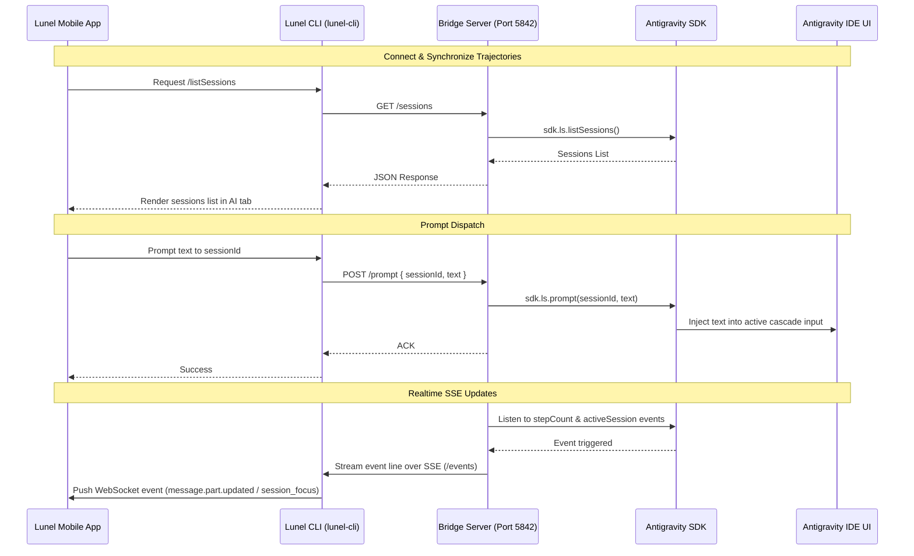

# Antigravity IDE Chat Extension

This is a custom VS Code / Antigravity IDE extension designed to bridge the IDE's autonomous agent chat sessions (Cascades) to the Lunel Mobile application, allowing you to view, monitor, and continue existing agent chat sessions from your phone.

## Features

- **Programmatic Bridge Server**: Spawns a lightweight local HTTP server at `127.0.0.1:5842` inside the extension's host.
- **RESTful Endpoints**:
  - `GET /sessions`: Lists all active agent trajectories (IDs, titles, steps, and last active timestamps).
  - `GET /messages?id=<sessionId>`: Retreives the message history of a specific cascade.
  - `POST /prompt`: Dispatches a new user message / instruction to an active cascade.
  - `POST /session/create`: Spawns a fresh trajectory/cascade.
  - `POST /session/rename`: Modifies the title of a cascade.
  - `POST /session/delete`: Deletes a cascade.
- **Event Streaming (SSE)**: Streams real-time updates through `GET /events`, including:
  - Active session changes (when the user switches tabs in the IDE).
  - Step transitions (when the agent runs terminal commands, searches the web, or updates files).
- **Aesthetic IDE Extensions**: Integrates custom UI buttons and token cost tracking metrics directly into the Antigravity IDE's layout.

---

## Architecture Diagram



---

## Getting Started

### 1. Installation
Install extension dependencies:
```bash
npm install
```

### 2. Build
Compile the extension code and copy SQLite WebAssembly files:
```bash
npm run build
```

This compiles `src/extension.ts` into `dist/extension.js` using `esbuild` and bundles it with the SQL WASM database engines (`sql-wasm.js` and `sql-wasm.wasm`).

### 3. Load the Extension
1. Launch your Antigravity IDE / VS Code instance.
2. Open the Command Palette (`Ctrl+Shift+P` or `Cmd+Shift+P`).
3. Search for **Developer: Install Extension from VSIX...** or sideload it using your local development settings (by pointing your workspace to the `antigravity-chat-extension/` directory).

---

## Technical Details

- **Port Configuration**: Defaults to `5842` (changeable in `src/extension.ts`).
- **Dependencies**: Uses `antigravity-sdk` to monitor agent lifecycles and interact with cascades.
